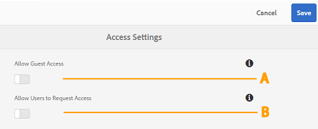

# Administer user access on Brand Portal {#administer-user-access-on-brand-portal}

Adobe Experience Manager Assets Brand Portal 6.4.2 onwards authorizes administrators to configure guest access and enable users to request access on the Brand Portal of their organization. These configurations have been provided as **[!UICONTROL Access Settings]** configurations on the administrative panel. Both the settings are disabled by default.

**A** - Configuration to let guests access on Brand Portal using the **[!UICONTROL `Guest Access?`]** link on the Brand Portal welcome screen. (Default is disabled)

**B** - Configuration to let users request access to Brand Portal using the **[!UICONTROL `Need access?`]** link on the Brand Portal welcome screen. (Default is disabled)

## Allow Guest Access {#allow-guest-access}

By allowing guest access, the users can access the public assets without having to log in to Brand Portal. 
To allow guest access, the administrator has to perform the following steps:

1. Select the AEM logo to access administrative tools from the toolbar at the top.
1. From the administrative tools panel, select **[!UICONTROL Access]** to open the **[!UICONTROL Access Settings]** page.
1. Enable the **[!UICONTROL Allow Guest Access]** configuration.
1. **[!UICONTROL Save]** the changes.
1. Log out to let the changes take effect.

## Allow Users to Request Access {#allow-users-to-request-access}

Administrators can allow the organization users to request access to Brand Portal from the welcome screen. However, administrators need to enable the **[!UICONTROL Allow Users to Request Access]** configuration so that the request access link appears on the welcome screen.

To let organization users request access on Brand Portal, administrators need to:

1. Select the AEM logo to access administrative tools from the toolbar at the top.
1. From the administrative tools panel, select **[!UICONTROL Access]** to open the **[!UICONTROL Access Settings]** page.
1. Enable the **[!UICONTROL Allow Users to Request Access]** configuration.
1. **[!UICONTROL Save]** the changes.
1. Log out to let the changes take effect.
