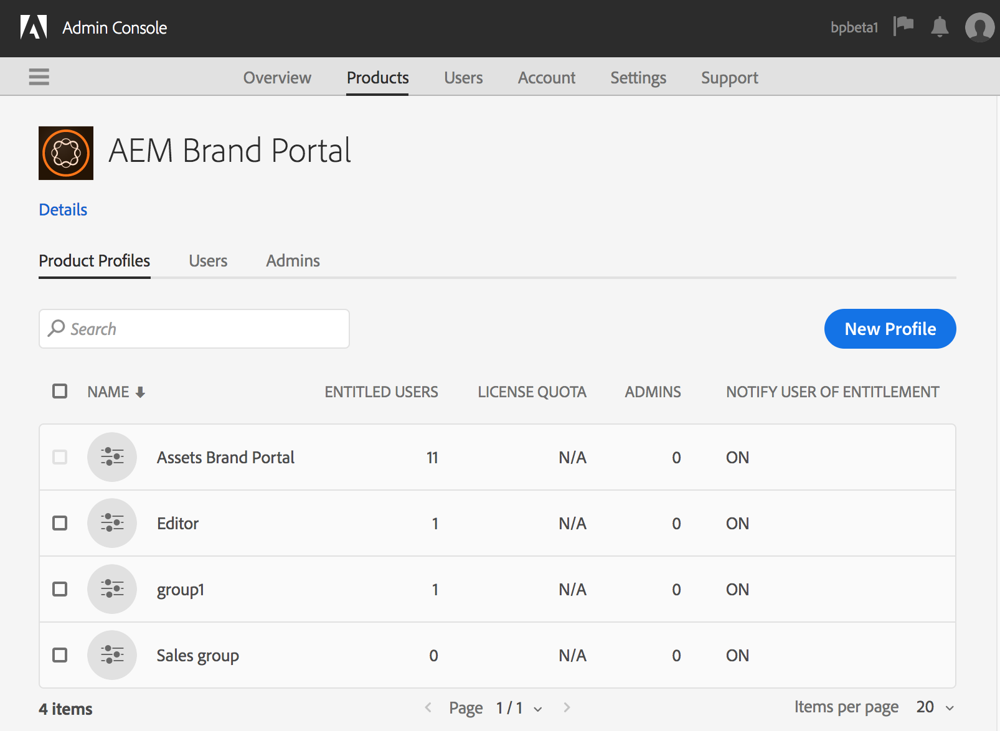
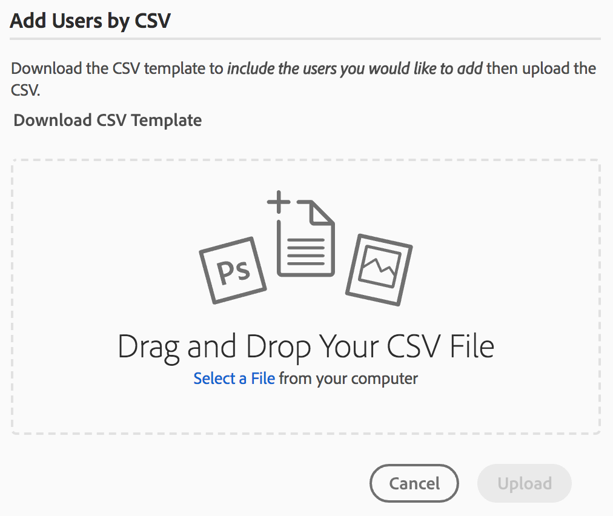

# Manage Users, Groups, and User Roles {#manage-users-groups-and-user-roles}

Administrators can use Adobe Admin Console to create Experience Manager Assets Brand Portal users and Product Profiles, and manage their roles using the Brand Portal user interface. This privilege is not available to Viewers and Editors.

In [[!UICONTROL Admin Console]](https://adminconsole.adobe.com/enterprise/overview), you can view all the products associated with your organization. A product could be any Experience Cloud solution, such as Adobe Analytics, Adobe Target, or Experience Manager Assets Brand Portal. Choose the AEM Brand Portal product, and create Product Profiles.

<!--
Comment Type: draft

<note type="note">

Product profiles (formerly known as product configurations*). 

* The nomenclature has changed from product configurations to Product Profiles in the new Adobe Admin Console.

</note>
-->

These Product Profiles are synced with the Brand Portal user interface every 8 hours and visible as groups in Brand Portal. Once you add users and create Product Profiles, and add users to those Product Profiles, you can assign roles to users and groups in Brand Portal.

>[!NOTE]
>
>To create groups in Brand Portal, from Adobe [!UICONTROL Admin Console], use **[!UICONTROL Products > Product Profiles]**, instead of **[!UICONTROL User page > User Groups]**. Product profiles in Adobe [!UICONTROL Admin Console] are used to create groups in Brand Portal.

## Add a user {#add-a-user}

If you are a Product Administrator, use Adobe [[!UICONTROL Admin Console]](https://adminconsole.adobe.com/enterprise/overview) to create users and assign them to Product Profiles (*formerly known as product configurations*), which show as groups in Brand Portal. You can use groups to perform bulk operations such as role management and asset sharing.

>[!NOTE]
>
>New users who do not have access to Brand Portal can request access from the login screen of Brand Portal. For more information, refer to [Request access to Brand Portal](../using/brand-portal.md#request-access-to-brand-portal). After you receive access request notifications in your notification area, click the relevant notification and then click **[!UICONTROL Grant Access]**. Alternatively, follow the link in the access request email received. Next, to add a user through [Adobe [!UICONTROL Admin Console]](https://adminconsole.adobe.com/enterprise/overview), follow Steps 4-7 in the procedure below.

>[!NOTE]
>
>You can log in to [Adobe [!UICONTROL Admin Console]](https://adminconsole.adobe.com/enterprise/overview) directly or from Brand Portal. If you log in directly, follow steps 4-7 below to add a user.

1. From the AEM toolbar at the top, click the Adobe logo to access administrative tools.

   

1. From the administrative tools panel, click **[!UICONTROL Users]**.

   

1. In the [!UICONTROL User Roles] page, click the **[!UICONTROL Management]** tab, then click **[!UICONTROL Launch Admin Console]**.

   

1. In the Admin Console, do one of the following to create a new user:

    * From the toolbar at the top, click **[!UICONTROL Overview]**. In the [!UICONTROL Overview] page, click **[!UICONTROL Assign Users]** from the Brand Portal product card.

   

    * From the toolbar at the top, click **[!UICONTROL Users]**. In the [!UICONTROL Users] page, [!UICONTROL Users] in the left rail are selected by default. Click **[!UICONTROL Add User]**.

   

1. In the Add User dialog box, type the email ID of the user you want to add or select the user from the list of suggestions that appear when you type.

   

1. Assign the user to at least one product profile (formerly known as product configurations) so that the user can access Brand Portal. Select the appropriate product profile from the **[!UICONTROL Please select a profile for this product]** field.
1. Click **[!UICONTROL Save]**. A welcome email is sent to the newly added user. The invited user can click on the link in the welcome email to access Brand Portal. The user can log in using the email id ([!UICONTROL Adobe ID], [!UICONTROL Enterprise ID], or [!UICONTROL Federated ID]) configured in the Admin Console. For more information, see [First-time login experience](../using/brand-portal-onboarding.md).

   >[!NOTE]
   >
   >If a user is unable to log on to Brand Portal, the Administrator of the organization should visit the Adobe [!UICONTROL Admin Console]. Check whether the user is present and has been added to at least one product profile.

   For information about granting administrative privileges to the user, see [Provide administrator privileges to users](../using/brand-portal-adding-users.md#provideadministratorprivilegestousers).

## Add a product profile {#add-a-product-profile}

Product profiles (formerly known as product configurations) in [!UICONTROL Admin Console] are used to create groups in Brand Portal so that you can perform bulk operations such as role management and asset sharing in Brand Portal. **Brand Portal** is the default product profile available; you can create more Product Profiles and add users to the new Product Profiles.

>[!NOTE]
>
>You can log in to [[!UICONTROL Admin Console]](https://adminconsole.adobe.com/enterprise/overview) directly or from Brand Portal. If your login to the [!UICONTROL Admin Console] directly, follow Steps 4-7 in the procedure below to add a product profile.

1. From the AEM toolbar at the top, click the Adobe logo to access administrative tools.

   

1. From the administrative tools panel, click **[!UICONTROL Users]**.

   

1. In the [!UICONTROL User Roles] page, click the **[!UICONTROL Management]** tab, then click **[!UICONTROL Launch Admin Console]**.

   

1. From the toolbar at the top, click **[!UICONTROL Products]**.
1. In the [!UICONTROL Products] page, [!UICONTROL Product Profiles] are selected by default. Click **[!UICONTROL New Profile]**.

   

1. In the [!UICONTROL Create a New Profile] page, provide the profile name, display name, and profile description. Choose to have users notified by email when they are added to or removed from the profile.

   

1. Click **[!UICONTROL Done]**. The product configuration group. For example, the **[!UICONTROL Sales group]**, is added to Brand Portal.

   

## Add users to a product profile {#add-users-to-a-product-profile}

To add users to a Brand Portal group, add them to the corresponding product profile (formerly known as product configurations) in the [!UICONTROL Admin Console]. You can add users individually or in bulk.

>[!NOTE]
>
>You can log in to [[!UICONTROL Admin Console]](https://adminconsole.adobe.com/enterprise/overview) directly or from Brand Portal. If your login to the Admin Console directly, follow Steps 4-7 in the procedure below to add users to a product profile.

1. From the toolbar at the top, click the Experience Manager logo to access administrative tools.

   

1. From the administrative tools panel, click **[!UICONTROL Users]**.

   

1. In the [!UICONTROL User Roles] page, click the **[!UICONTROL Management]** tab, then click **[!UICONTROL Launch Admin Console]**.

   ![Launch [!DNL Admin Console]](assets/launch_admin_console.png)

1. From the toolbar at the top, click **[!UICONTROL Products]**.
1. In the [!UICONTROL Products] page, [!UICONTROL Product Profiles] are selected by default. Open the product profile to which you want to add a user, for example, [!UICONTROL Sales group].

   

1. To add individual users to the product profile, do the following:

    * Click **[!UICONTROL Add User]**.

   

    * In the [!UICONTROL Add User to Sales group] page, type the email ID of the user you want to add or select the user from the list of suggestions that appear as you type.

   

    * Click **[!UICONTROL Save]**.

1. To add bulk users to the product profile, do the following:

    * Choose **[!UICONTROL ellipsis (...) > Add users by CSV]**.

   

    * In the **[!UICONTROL Add Users by CSV]** page, download a CSV template or drag-and-drop a CSV file.

   

    * Click **[!UICONTROL Upload]**.

   When you add users to the default product profile, Brand Portal, the system sends a welcome email to their email IDs. The invited users can then access Brand Portal by clicking the link in the welcome email and signing in with their [!UICONTROL Adobe ID]. See [First-time login experience](../using/brand-portal-onboarding.md).

   Users added to a custom or a new product profile do not receive email notifications.

## Provide administrator privileges to users {#provide-administrator-privileges-to-users}

You can grant a Brand Portal user either System Administrator or Product Administrator privileges. However, avoid assigning other administrative roles available in the [!UICONTROL Admin Console]. For example, product profile administrator, user group administrator, and support administrator. See [Administrative roles](https://helpx.adobe.com/enterprise/using/admin-roles.html).

>[!NOTE]
>
>You can log in to [[!UICONTROL Admin Console]](https://adminconsole.adobe.com/enterprise/overview) directly or from Brand Portal. If your login to the [!UICONTROL Admin Console] directly, follow Steps 4-8 in the procedure below to add a user to a product profile.

1. From the AEM toolbar at the top, click the Adobe logo to access administrative tools.

   

1. From the administrative tools panel, click **[!UICONTROL Users]**.

   

1. In the [!UICONTROL User Roles] page, click the **[!UICONTROL Management]** tab, then click **[!UICONTROL Launch Admin Console]**.

   

1. From the toolbar at the top, click **[!UICONTROL Users]**.
1. On the [!UICONTROL Users] page, in the left rail, [!UICONTROL Users] are selected by default. Click the user name of the user to whom you want to provide administrator privileges.

   

1. In the user profile page, locate the **[!UICONTROL Administrative Rights]** section at the bottom, and choose **[!UICONTROL ellipsis (...) > Edit admin rights]**.
   

1. In the [!UICONTROL Edit Admin] page, select System Administrator or Product Administrator.

   

   >[!NOTE]
   >
   >Brand Portal supports only System Administrator and Product Administrator roles.
   >
   >Adobe recommends that you avoid using the System Administrator role because it grants organization-wide administrator privileges for all the products of an organization. For example, a System Administrator of an organization that includes three cloud products for marketing, has the entire set of privileges for all three products. Only a System Administrator can configure Experience Manager Assets so that assets can be published from Experience Manager Assets to Brand Portal. For more information, see [Configure Experience Manager Assets with Brand Portal](../using/configure-aem-assets-with-brand-portal.md).
   >
   >In contrast, the Product Administrator role grants administrator privileges for a specific product only. If you want to enforce a more granular access control within Brand Portal, use the Product Administrator role and select the product as Brand Portal.

   >[!NOTE]
   >
   >Brand Portal does not support product profile administrator (formerly known as configuration administrator) privileges. Avoid assigning product profile administrator rights to a user.

1. Review the admin type selection and click **[!UICONTROL Save]**.

   >[!NOTE]
   >
   >To revoke administrator privileges for a user, make the appropriate changes in the **[!UICONTROL Edit Admin]** page, and then click **[!UICONTROL Save]**.

## Manage user roles {#manage-user-roles}

An Administrator can modify roles for users in Brand Portal.

In addition to the Administrator role, Brand Portal supports the following roles:

* [!UICONTROL Viewer]: Users with this role can view the files and folders that an Administrator shares with them. Viewers can also search and download assets. However, Viewers cannot share content (files, folders, [!UICONTROL collections]) with other users.
* [!UICONTROL Editor]: Users with this role have all the privileges of a Viewer. In addition, Editors can share content (folders, [!UICONTROL collections], links) with other users.

1. From the AEM toolbar at the top, click the Adobe logo to access administrative tools.

   

1. From the administrative tools panel, click **[!UICONTROL Users]**.

   

1. In the [!UICONTROL User Roles] page, the [!UICONTROL Users] tab is selected by default. For the user whose role you want to change, select **[!UICONTROL Editor]** or **[!UICONTROL Viewer]** from the **[!UICONTROL Role]** drop-down.

   

   To modify the role of multiple users simultaneously, select the users and choose the appropriate role from the **[!UICONTROL Role]** drop-down.

   >[!NOTE]
   >
   >The [!UICONTROL Role] list for Administrator users is disabled. You cannot select these users to modify their roles.

   >[!NOTE]
   >
   >The user role is also disabled if the user is a member of the Editor group. To revoke editing privileges from the user, either remove the user from the Editor group or change the role of the entire group to Viewer.

1. Click **[!UICONTROL Save]**. The role is modified for the corresponding user. If you selected multiple users, the roles for all the users are modified simultaneously.

   >[!NOTE]
   >
   >Changes in user permissions are reflected in the **[!UICONTROL User Roles]** page only after the users re-login to Brand Portal.

## Manage group roles and privileges {#manage-group-roles-and-privileges}

An Administrator can associate specific privileges with a [group](../using/brand-portal-adding-users.md#main-pars-title-278567577) of users on Brand Portal. The **[!UICONTROL Groups]** tab on the **[!UICONTROL User Roles]** page allows administrators to:

* Assign roles to user groups
* Restrict user groups to download original renditions of image files (.jpeg, .tiff, .png, .bmp, .gif, .pjpeg, x-portable-anymap, x-portable-bitmap, x-portable-graymap, x-portable-pixmap, x-rgb, x-xbitmap, x-xpixmap, x-icon, image/photoshop, image/x-photoshop, .psd, image/vnd.adobe.photoshop) from Brand Portal.

>[!NOTE]
>
>For the assets shared as the link, the permission to access original renditions of image files apply based on the permissions of the user who is sharing the assets.

To modify the role and right to access original renditions for specific group members, follow these steps:

1. On the **[!UICONTROL User Roles]** page, navigate to the **[!UICONTROL Groups]** tab.
1. Select the groups for which you want to change roles.
1. Select the appropriate role from the **[!UICONTROL Role]** drop-down list.

   To let group members access original renditions of image files they download from the portal or shared link, keep the **[!UICONTROL Access to Original]** option selected for that group. This approach includes file types such as the following:
   
   * .jpeg
   * .tiff
   * .png
   * .bmp
   * .gif
   * .pjpeg
   * .psd
   * x-portable-anymap
   * x-portable-bitmap
   * x-portable-graymap
   * x-portable-pixmap
   * x-rgb
   * x-xbitmap
   * x-xpixmap
   * x-icon
   * image/photoshop
   * image/x-photoshop
   * image/vnd.adobe.photoshop
   
   By default, the **[!UICONTROL Access to Original]** option is selected for all the users. To prevent a user group from accessing original renditions, deselect the option corresponding to that group.

   

   >[!NOTE]
   >
   >If a user is added to multiple groups and if one of these groups has restrictions, the restrictions apply to that user.
   >
   >Also, any restrictions for accessing the original renditions of image files do not apply to administrators even though they are members of restricted groups.

1. Click **[!UICONTROL Save]**. The role is modified for the corresponding groups.

   >[!NOTE]
   >
   >The user-to-group association, or the group membership of a user, is synced to Brand Portal every 8 hours. Changes to user or group roles are effective after the next sync job runs.
