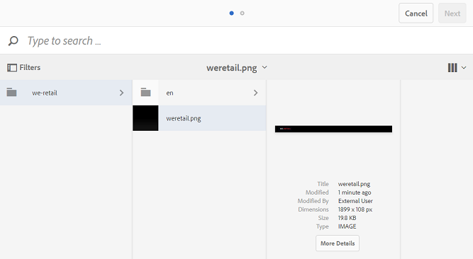

# Customize wallpaper, header, and email message {#customize-wallpaper-header-and-email-message}

 Brand Portal administrators can make limited customizations to the interface displayed to users. You can choose a specific background image (wallpaper) for the Brand Portal login page. You can also add a header image and customize asset sharing emails to match the customer’s brand.

## Customize the login screen wallpaper {#customize-the-login-screen-wallpaper}

In the absence of a custom branded wallpaper image, a default wallpaper is displayed on the login page.

1. From the AEM toolbar at the top, click the Adobe logo to access administrative tools.

   

1. From the administrative tools panel, click **[!UICONTROL Branding]**.

   

1. On the left rail of the **[!UICONTROL Configure Branding]** page, **[!UICONTROL Wallpaper]** is selected by default. The default background image that appears on the login page is displayed.

   

1. To add a new background image, click the **[!UICONTROL Choose Image]** icon from the toolbar at the top.

   

   Do one of the following:

    * To upload an image from your computer, click **[!UICONTROL Upload]**. Navigate to the required image and upload it.
    * To use an existing Brand Portal image, click **[!UICONTROL Select from existing]**. Choose an image using the asset picker.

   

1. Specify a header text and description for the background image. To save the changes, click **[!UICONTROL Save]** from the toolbar at the top.

1. From the toolbar at the top, click the **[!UICONTROL Preview]** icon to generate a preview of the Brand Portal interface with the image.

   
   
   

1. To activate or deactivate the default wallpaper, do the following in the **[!UICONTROL Configure Branding > Wallpaper]** page:

    * To display the default wallpaper image on the Brand Portal login page, click **[!UICONTROL Deactivate Wallpaper]** from the toolbar at the top. A message confirms that the custom image is deactivated.

   

    * To restore the custom image on the Brand Portal login page, click **[!UICONTROL Activate Wallpaper]** from the toolbar. A message confirms that the image is restored.

   

    * Click **[!UICONTROL Save]** to save the changes.

## Customize the header {#customize-the-header}

The header appears on various Brand Portal pages after you log in to Brand Portal.

1. From the AEM toolbar at the top, click the Adobe logo to access administrative tools.

   

1. From the administrative tools panel, click **[!UICONTROL Branding]**.

   

1. To customize the page header for the Brand Portal interface, on the **[!UICONTROL Configure Branding]** page, select **[!UICONTROL Header Image]** from the left rail. The default header image is displayed.

   

1. To upload a header image, click the **[!UICONTROL Choose Image]** icon and choose **[!UICONTROL Upload]**.

   To use an existing  Brand Portal image, choose **[!UICONTROL Select from existing]**.

   

   Choose an image using the asset picker.

   

1. To include a URL in the header image, specify it in the **[!UICONTROL Image URL]** box. You can specify external or internal URLs. Internal links can also be relative links, for example,
 [!UICONTROL `/mediaportal.html/content/dam/mac/tenant_id/tags`].
 This link directs users to the tags folder.
 To save the changes, click **[!UICONTROL Save]** from the toolbar at the top.

   

1. From the toolbar at the top, click the **[!UICONTROL Preview]** icon to generate a preview of the  Brand Portal interface with the header image.

   
   

1. To activate or deactivate the header image, do the following in the **[!UICONTROL Configure Branding > Header Image]** page:

    * To prevent a header image from appearing on  Brand Portal pages, click **[!UICONTROL Deactivate Header]** from the toolbar at the top. A message confirms that the image is deactivated.

   

    * To make the header image reappear on  Brand Portal pages, click **[!UICONTROL Activate Header]** from the toolbar at the top. A message confirms that the image is activated.

   

    * Click **[!UICONTROL Save]** to save the changes.

## Customize the email messaging {#customize-the-email-messaging}

When assets are shared as a link, users receive an email containing the link. Administrators can customize the messaging, that is, logo, description, and footer, of these emails.

1. From the  AEM toolbar at the top, click the Adobe logo to access administrative tools.

   

1. From the administrative tools panel, click **[!UICONTROL Branding]**.

   

1. When assets are shared as links or downloaded through emails, and when  **[!UICONTROL collections]** are shared, email notifications are sent to users. To customize the email message, on the **[!UICONTROL Configure Branding]** page, select **[!UICONTROL Email Message]** from the left rail.

   

1. To add a logo to outgoing emails, click **[!UICONTROL Upload]** from the toolbar at the top.

1. In the **[!UICONTROL Description]** section, specify the email header and footer text. To save the changes, click **[!UICONTROL Save]** from the toolbar at the top.

   >[!NOTE]
   >
   >If you do not use the recommended size for the logo, or if the header and footer text exceed the recommended word count, the content in the email message may appear garbled.
