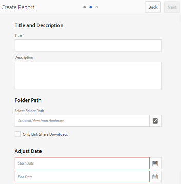
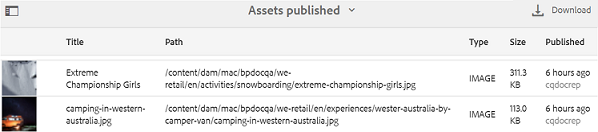

# Work with reports {#work-with-reports}

The reporting capability is instrumental in assessing Brand Portal usage, and knowing how internal and external users interact with approved assets. Administrators can view the Brand Portal Usage report, which is always available on the Asset Reports page. However, reports for user logins and assets downloaded, expired, published, and assets shared through links can be generated and viewed from the Asset Reports page. These reports are helpful in analyzing asset deployment, which let you derive key success metrics to measure the adoption of approved assets within and outside your organization.

The report management interface is intuitive and includes fine-grained options and controls to access saved reports. You can view, download, or delete reports from the Asset Reports page, where all previously generated reports are listed.

## View reports {#view-reports}

To view a report, follow these steps:

1. From the toolbar at the top, click the Experience Manager logo to access administrative tools.

   

1. From the administrative tools panel, click **[!UICONTROL Create/Manage Reports]** to open the **[!UICONTROL Asset Reports]** page.

   

1. Access **[!UICONTROL Usage]** report and other generated reports from the Asset Reports page.

   >[!NOTE]
   >
   >Usage report is a default report generated in Brand Portal. It cannot be created or deleted. However, you can create, download and delete the Download, Expiration, Publish, `Link Share`, and user logins reports.

   To view a report, click the report link. Alternatively, select the report, and click the View icon from the toolbar.

   The **[!UICONTROL Usage Report]** displays information about the number of active Brand Portal users, the storage space occupied by all the assets, and the total assets count in Brand Portal. The Brand Portal users who are not assigned to any product profile in the Admin Console are considered as inactive users and are not reflected in the **[!UICONTROL Usage Report]**. 
   The report also displays the permitted capacity for each of these information metrics.

   

   The **[!UICONTROL User Logins]** report gives information about the users who logged in to Brand Portal. The report shows display names, email IDs, personas (admin, viewer, editor, guest), groups, last login, activity status, and log in count of each user from Brand Portal 6.4.2 deployment until the time of report generation.

   

   **[!UICONTROL Download]** report lists and details about all the assets downloaded in a specific date and time range.

   

   >[!NOTE]
   >
   >The assets **[!UICONTROL Download]** report displays only the assets that were individually selected and downloaded from Brand Portal. If a user has downloaded a folder containing assets, the report does not display the folder or the assets inside the folder.

   The **[!UICONTROL Expiration]** report lists and details all the assets that expired in a specific time frame.

   

   **[!UICONTROL Publish]** report lists and gives information about all the assets that are published from Experience Manager Assets to Brand Portal in a specified time frame.

   

   >[!NOTE]
   >
   >Publish Report does not display information about content fragments, as the content fragments cannot be published to the Brand Portal.

   The **[!UICONTROL Link Share]** report lists all the assets shared through links from the Brand Portal interface in a specific time frame. The report details when the asset was shared through a link, which user shared it, and the link's expiration date. It also reports the number of shared links for the tenant and users. The columns of the Link Share Report are not customizable.

   

   >[!NOTE]
   >
   >The Link Share Report does not display users who have access to the asset shared by way of the link or have downloaded the asset through the link.
   >
   >For tracking downloads through the shared link, you need to generate a download report after selecting the **[!UICONTROL Only Link Share Downloads]** option on the **[!UICONTROL Create Report]** page. However, the user (Downloaded by) is anonymous in this case.

## Generate reports {#generate-reports}

Administrators can generate and manage the following standard reports. After generation, the reports are saved for [later access](../using/brand-portal-reports.md#main-pars-header).

* User Logins
* Download
* Expiration
* Publish
* Link Share

The columns in the Download, Expiration, and Publish report can be customized for viewing. To generate a report, follow these steps:

1. From the toolbar at the top, click the Experience Manager logo to access administrative tools.

1. From the administrative tools panel, click **[!UICONTROL Create/Manage Reports]** to open the **[!UICONTROL Asset Reports]** page.

   

1. In the Asset Reports page, click **[!UICONTROL Create]**.
1. From the **[!UICONTROL Create Report]** page, select a report to create, and click **[!UICONTROL Next]**.

   

1. Configure report details. Specify title, description, folder structure (where the report needs to run and generate statistics), and date range for **[!UICONTROL Download]**, **[!UICONTROL Expiration]**, and **[!UICONTROL Publish]** reports.

   

   The **[!UICONTROL Link Share]** report only needs the title, description, and date range parameters.

   

   >[!NOTE]
   >
   >Generating the report replaces special characters `#` and `%` in the title with a hyphen (-).

1. Click **[!UICONTROL Next]**, to configure the columns of Download, Expiration, and Publish reports.
1. Select or deselect the appropriate checkboxes as required. For example, to view names of users (who downloaded assets) in the **[!UICONTROL Download]** report, select **[!UICONTROL Downloaded By]**. The following image illustrates selecting the default columns in the Download report.

   

   You can also add Custom Columns to these reports to display more data for your custom requirements.

   To add Custom Columns to the Download, Publish, or Expiration report, do the following:

    1. To display a custom column, click **[!UICONTROL Add]** within [!UICONTROL Custom Columns].
    1. Specify the name of the column in the **[!UICONTROL Column Name]** field.
    1. Select the property to which the column needs to map, using a property picker.

       
Alternatively, type the path in the property path field.

       
    
       To add more Custom Columns, click **Add** and repeat steps 2 and 3.

1. Click **[!UICONTROL Create]**. A message notifies that report generation has been initiated.

## Download reports {#download-reports}

To save and download a report as a .csv file, do one of the following:

* Select a report on the Asset Reports page, and click **[!UICONTROL Download]** from the toolbar at the top.

* From Asset Reports page, open a report. Select the **[!UICONTROL Download]** option from the top of the report page.

## Delete reports {#delete-reports}

To delete an existing report, select the report from the **[!UICONTROL Asset Reports]** page and click **[!UICONTROL Delete]** from the toolbar at the top.

>[!NOTE]
>
>**[!UICONTROL Usage]** report cannot be deleted.
