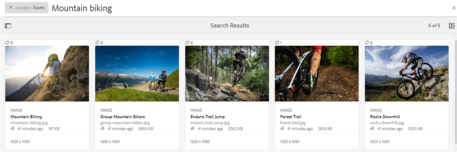

# Search assets on Brand Portal {#search-assets-on-brand-portal}

Brand Portal search capability lets you quickly search relevant assets using Omnisearch, and facet search that uses filters to help you further narrow down your search. You can search assets at files or folder level and save your search results as smart collections. 

>[!NOTE]
>
>Brand Portal does not support Collection search using Omnisearch.
>
>However, you can use [search filters to get the list of relevant collections](#search-collection). 

## Search assets using Omnisearch {#search-assets-using-omnisearch}

To search for assets on Brand Portal:

1. From the toolbar, click the **[!UICONTROL Search]** icon, or press the **[!UICONTROL /]** (forward slash) key to launch Omnisearch.

   

1. In the search box, type a keyword for the assets you want to search.

   

   >[!NOTE]
   >
   >* At least 3 characters are required in Omnisearch for search suggestions to appear.
   >* When you search for `mountain biking`, Omnisearch returns all assets in the search results that have both `mountain` and `biking` available in the metadata fields. For example, `mountain` in the `Title` field and `biking` in the `Description` field. Both the terms must be available in the metadata fields to display in the search results. However, Omnisearch returns the asset in the search results even if only one of the two terms is available in the Smart Tags metadata field. For example, suppose that an asset has `mountain` as a Smart Tag but lacks `biking` in any other metadata field. Then you search for `mountain biking`. Omnisearch still returns the asset in the search results. This workflow ensures that assets with relevant tags are not missed.

1. Select from the related suggestions that appear in the drop-down list to access relevant assets quickly.

   

   *Asset search using Omnisearch*

To know more about search behavior with smart tagged assets, go to [understand search results and behavior](https://experienceleague.adobe.com/en/docs/experience-manager-65/content/assets/using/search-assets).

## Search using facets in Filters panel {#search-using-facets-in-filters-panel}

Search facets in the Filters panel add granularity to your search experience and make the search functionality more efficient. Search facets use multiple dimensions (predicates) that enable you to perform intricate searches. You can easily drill down to the desired level of detail for a more focused search.

For example, if you are looking for an image, you can choose whether you want a bitmap or a vector image. You can further narrow the search scope by specifying the image's MIME type in the File Type search facet. Similarly, when searching for documents, you can specify the format, for example, PDF or MS&reg; Word format.

The **[!UICONTROL Filters]** panel includes a few standard facets, such as- **[!UICONTROL Path Browser]**, **[!UICONTROL File Type]**, **[!UICONTROL File Size]**, **[!UICONTROL Status]**, and **[!UICONTROL Orientation]**. 
However, you can [add custom search facets](../using/brand-portal-search-facets.md) or remove specific ones from the **[!UICONTROL Filters]** panel. Just edit the predicates in the underlying Search Form. See the list of the available and usable [search predicates on Brand Portal](../using/brand-portal-search-facets.md#list-of-search-predicates).

To apply filters to your search, using the available [search facets](../using/brand-portal-search-facets.md):

1. Click the overlay icon and select **[!UICONTROL Filter]**.

   

1. From the **[!UICONTROL Filters]** panel on the left, select the appropriate options to apply the relevant filters.
   For example, use the following standard filters:

    * **[!UICONTROL Path Browser]** to search assets in a specific directory. The default search path of the predicate for Path Browser is `/content/dam/mac/<tenant-id>/`, which can be configured by editing the default Search Form.

   >[!NOTE]
   >
   >To non-admin users, the [!UICONTROL Path Browser] in the [!UICONTROL Filter] panel shows only the content structure of the folders (and their ancestor folders) shared with them.  
   >To admin users, Path Browser allows navigating to any folder in Brand Portal.

    * **[!UICONTROL File Type]** to specify the type (image, document, multimedia, archive) of asset file you are looking for. Further, you can narrow down the scope of your search, for example, specify the MIME type (Tiff, Bitmap, GIMP Images) for image or format (PDF or MS&reg; Word) for the documents.
    * **[!UICONTROL File Size]** to search for assets based on their size. You can specify the lower and upper limits for the size range to narrow down your search and specify the unit of measure to search.
    * **[!UICONTROL Status]** to search for assets based on asset statuses, such as Approval (Approved, Changes Requested, Rejected, Pending) and Expiration.
    * **[!UICONTROL Average Rating]** to search for assets based on the rating of the assets.
    * **[!UICONTROL Orientation]** to search for assets based on the orientation (horizontal, vertical, square) of the assets.
    * **[!UICONTROL Style]** to search for assets based on the style (colored, monochrome) of the assets.
    * **[!UICONTROL Video Format]** to search for video assets based on their format (DVI, Flash, MPEG4, MPEG, OGG Theora, QuickTime, Windows Media, WebM).

   You can use [custom search facets](../using/brand-portal-search-facets.md) in the Filters panel by editing the underlying Search Form.

    * **[!UICONTROL Property Predicate]** if used in the Search Form, lets you search for assets that match a metadata property to which the predicate is mapped.  
      For example, if Property Predicate is mapped to `jcr:content/metadata/dc:title`, you can search assets based on their title.  
      The [!UICONTROL Property Predicate] supports text searches for:  

      **Partial phrases**
      To allow the asset search using partial phrases in Property Predicate, enable the **[!UICONTROL Partial Search]** checkbox in Search Form. This method lets you search for the desired assets even if you do not specify the exact words or phrases used in the asset metadata.

      >[!NOTE]
      >
      > Brand Portal supports the following fields for Partial Search:
      >
      >* `jcr:content/metadata/dc:title`
      >* `jcr:content/jcr:title`
      >* `jcr:content/metadata/dc:format`

      You can:
        * Specify a word occurring in your searched phrase in the facet in the Filters panel. For example, if you search for the term **climb** (and Property Predicate is mapped to the `dc:title` property), then all the assets with the word **climb** in their title phrase are returned.
        * Specify a part of the word occurring in your searched phrase, along with a wildcard character (&#42;) to fill the gaps.
          For example, searching for:
          * **climb&#42;** returns all the assets having words beginning with the characters "climb" in their title phrase.
          * **&#42;climb** returns all the assets having words ending with characters "climb" in their title phrase.
          * **&#42;climb&#42;** returns all the assets having words comprising the characters "climb" in their title phrase.  
      
      **Non-case sensitive text**
      You can allow non-case sensitive search in Property Predicate. Just enable the **[!UICONTROL Ignore Case]** checkbox in the Search Form. By default, the text search in Property Predicate is case-sensitive.

   >[!NOTE]
   >
   >On selecting the **[!UICONTROL Partial Search]** checkbox, **[!UICONTROL Ignore Case]** is selected by default.

   

   The search results are displayed according to the filters applied, along with the search results count.

   

   Asset search result with search result count.

1. You can easily navigate to an item from the search result, and return to the same search result using the back button in your browser without having to re-run the search query.

## Save your searches as smart collection {#save-your-searches-as-smart-collection}

You can save the search settings as a smart collection to be able to repeat the same search quickly without having to redo the same settings later. However, you cannot apply search filters in a collection.    

To save the search settings as a smart collection:

1. Click **[!UICONTROL Save Smart Collection]** and provide a name for the smart collection.

   To make the smart collection accessible to all users, select **[!UICONTROL Public]**. A message confirms that the smart collection was created and added to the list of your saved searches.

   >[!NOTE]
   >
   >You can restrict non-admin users from making smart collections public to avoid having a huge number of public smart collections created by non-admin users on the organization's Brand Portal. Organizations can disable the **[!UICONTROL Allow public smart collections creation]** configuration from the **[!UICONTROL General]** settings available in the admin tools panel.

   

1. To save the smart collection in a different name, and select or clear the **[!UICONTROL Public]** checkbox, click **[!UICONTROL Edit Smart Collection]**.

   

1. On the **[!UICONTROL Edit Smart Collection]** dialog box, select **[!UICONTROL Save As]** and enter a name for the smart collection. Click **[!UICONTROL Save]**.

   

## Search collection {#search-collection}

Omnisearch is not supported for collections. However, you can apply search filters to list the relevant collections from within the [!UICONTROL Collections] interface. 

From the [!UICONTROL Collections] interface, click the overlay icon to open the filter panel in the left rail. Apply single or multiple search filters from the available filters (`modified date`, `access type`, and `tags`). It lists the most relevant set of collections based on the applied filters.    

