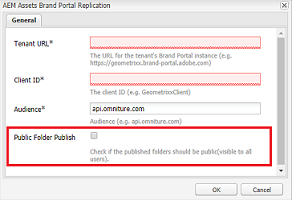

# Share folders on Brand Portal {#share-folders}

Assets need to be published to Brand Portal from a pre-configured Experience Manager Author instance, as Brand Portal does not support asset ingestion.

## Folder sharing workflow in Brand Portal {#folder-sharing-workflow-in-brand-portal}

The following describes the folder share workflow and user access:

* By default, all the folders published from Experience Manager Assets to Brand Portal are visible only to the Brand Portal Administrator, unless marked as public while configuring replication.
* The Administrator uses the **[!UICONTROL Folder Properties]** console to share a folder with selective users or groups. Only those users or groups with whom the folder is shared can see the folder after they log in to Brand Portal. The folder is not visible to other users.
* The Administrator can also choose to make a folder public through the **[!UICONTROL Public Folder]** check box in the **[!UICONTROL Folder Properties]** console. A public folder is visible to all the users.

* Irrespective of user roles and privileges, when users log in to Brand Portal, they see all the public folders, and the folders directly shared with them or with a group to which they belong. Private folders, or folders shared with other users, are not visible to all users.

### Share folders with user groups on Brand Portal {#sharing-folders-with-user-groups-on-brand-portal}

Access rights on assets of a folder are dependant on the access rights on its parent folder, irrespective of the settings of children folders. [ACLs](https://experienceleague.adobe.com/en/docs/experience-manager-65/content/security/security) in AEM govern this behavior, with child folders inheriting ACLs from their parent folders. For example, suppose folder A contains folder B, which contains folder C. Then a user group (or users) having access rights on folder A also have the same access rights on folder B and folder C. Folder B being the child folder of A inherits its ACLs, and folder C being the child folder of B inherits its ACLs.

Similarly, user groups (or users) having permissions to access only folder B have the same access permissions on folder C but not on folder A. Adobe recommends organizing content so that the most exposed assets are placed in child folders, allowing access to be restricted from the child folders up to the root folder.

### Public folder publish {#public-folder-publish}

Non-admin users (such as Editors and Viewers) can access assets published from AEM Assets to Brand Portal only if the **[!UICONTROL Public Folder Publish]** option is selected during Brand Portal replication configuration.

If the **[!UICONTROL Public Folder Publish]** option is disabled, administrators need to share these assets specifically with non-admin users using the share capability.

>[!NOTE]
>
>The option to enable **[!UICONTROL Public Folder Publish]** is available in AEM 6.3.2.1 onwards.

## Access to shared folders {#access-to-shared-folders}

The following matrix discusses the access rights and rights to share or unshare assets for various user roles:  

|               | Access to all folders published from AEM Assets to Brand Portal | Access to shared folders | Share or unshare folder rights |
|---------------|-----------|-----------|------------|
| Administrator | Yes | Yes | Yes |
| Editor | No* | Yes, only if shared with them or with the group to which they belong | Yes, only for the folders shared with them or with the group to which they belong |
| Viewer | No* | Yes, only if shared with them or with the group to which they belong | No |
| Guest User | No* | Yes, only if shared with them or with the group to which they belong | No |

>[!NOTE]
>
>By default, the **[!UICONTROL Public Folder Publish]** option is disabled while configuring replication of Brand Portal with AEM Author. If the option is enabled, then the folders published to Brand Portal are accessible to all the users (non-admin users also) by default.

### Non-admin user access to shared folders {#non-admin-user-access-to-shared-folders}

Non-admin users can access only the folders shared with them on Brand Portal. However, how these folders are displayed on the portal when they log in depends on the settings of the **[!UICONTROL Enable Folder Hierarchy]** configuration.

**If the configuration is disabled**

Non-admin users can see all the folders shared with them on the landing page, on logging in to the Brand Portal.

**If the configuration is enabled**

Non-admin users see the folder tree (starting from the root folder) and the shared folders arranged within their respective parent folders, on logging in to the Brand Portal.

These parent folders are virtual folders and no actions can be performed on them. You can recognize these virtual folders with a lock icon.

No action tasks are visible on hovering or selecting them in **[!UICONTROL Card View]**, unlike the shared folders. The **[!UICONTROL Overview]** button is shown on selecting a virtual folder in **[!UICONTROL Column View]** and **[!UICONTROL List View]**.

>[!NOTE]
>
>Note that the default thumbnail of the virtual folders is the thumbnail image of the first shared folder.

   

## Share folders {#how-to-share-folders}

To share a folder with users on Brand Portal, follow these steps:

1. Click the overlay icon on the left, and choose **[!UICONTROL Navigation]**.

   

1. From the side rail on the left, select **[!UICONTROL Files]**.

   

1. From the Brand Portal interface, select the folder you want to share.

   

1. From the toolbar at the top, select **[!UICONTROL Share]**.

   

   The [!UICONTROL Folder Properties] console appears.

   

1. In the **[!UICONTROL Folder Properties]** console, specify the folder title in the **[!UICONTROL Folder Title]** field if you do not want the default name to be displayed to users.
1. From the **[!UICONTROL Add User]** list, select the users or groups with which you want to share the folder, and click **[!UICONTROL Add]**.
To share the folder with guest users only, and no other users, select **[!UICONTROL Anonymous Users]** from the **[!UICONTROL Members]** dropdown.

   

   >[!NOTE]
   >
   >To make the folder available to all users irrespective of their group membership and role, make it public by selecting the **[!UICONTROL Public Folder]** check box.

1. If necessary, click **[!UICONTROL Change Thumbnail]** to modify the thumbnail image for the folder.
1. Click **[!UICONTROL Save]**.

1. To access the shared folder, log in to Brand Portal with the credentials of the user you shared the folder with. Review the shared folder in the interface.

## Unshare folders {#unshare-the-folders}

To unshare a previously shared folder, follow these steps:

1. From the Brand Portal interface, select the folder you want to unshare.

   

1. From the toolbar at the top, click **[!UICONTROL Share]**.
1. In the **[!UICONTROL Folder Properties]** console, under **[!UICONTROL Members]**, click the **[!UICONTROL x]** symbol next to a user to remove them from the list of users you shared the folder with.

   

1. In the warning message box, click **[!UICONTROL Confirm]** to confirm unshare.
Click **[!UICONTROL Save]**.

1. Log in to Brand Portal with the credentials of the user you removed from the shared list. The folder is no longer available in the Brand Portal interface for the user.
