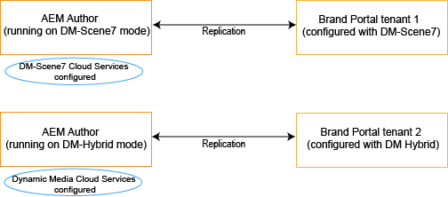

# Dynamic video support on Brand Portal {#dynamic-video-support-on-brand-portal}

Preview and play videos adaptively on Brand Portal with Dynamic Media support. Also download the dynamic renditions from the portal and shared links.
Brand Portal users can:

* Preview videos in the Asset Details page, Card View, and link share preview page.
* Play video encodes on the Asset Details page.
* View dynamic renditions in the Renditions tab on the Asset Details page.
* Download video encodes and folders containing videos.

>[!NOTE]
>
>To work with videos and to publish them to Brand Portal, make sure that your Experience Manager Author instance is set up either in Dynamic Media Hybrid mode or Dynamic Media **[!DNL Scene7]** mode.

To preview, play, and download videos, Brand Portal exposes the following two configurations to administrators:

* [Dynamic Media Hybrid configuration](#configure-dm-hybrid-settings)
If Experience Manager Author instance is running in Dynamic Media - Hybrid mode.
* [Dynamic Media [!DNL Scene7] configuration](#configure-dm-scene7-settings)
If Experience Manager Author instance is running in Dynamic Media - **[!DNL Scene7]** mode.
Set either of these configurations based on the configurations you set in your Experience Manager Author instance with which the Brand Portal tenant is replicated.

>[!NOTE]
>
>Dynamic videos are not supported on Brand Portal tenants configured with Experience Manager Author running on **[!UICONTROL Scene7 Connect]** run mode.

## How are dynamic videos played? {#how-are-dynamic-videos-played}

If Dynamic Media configurations ([Hybrid](../using/dynamic-video-brand-portal.md#configure-dm-hybrid-settings) or [[!DNL Scene7]](../using/dynamic-video-brand-portal.md#configure-dm-scene7-settings) configurations) are set up on Brand Portal, the dynamic renditions are fetched from the **[!DNL Scene7]** server. Video encodes are, therefore, previewed and played without delay and distortion in quality.

The Brand Portal repository does not store video encodes and fetches them from the **[!DNL Scene7]** server. Ensure that the Dynamic Media configurations on both the Adobe Experience Manager Author Instance and Brand Portal are the same.

>[!NOTE]
>
>Video viewers and viewer presets are not supported in Brand Portal. Videos are previewed and played on the default viewers in Brand Portal.

## Prerequisites {#prerequisites}

To work with dynamic videos on Brand Portal, make sure to:

* **Start up Experience Manager Author in Dynamic Media mode**

   Start the Experience Manager Author instance (with which Brand Portal is configured) either in [Dynamic Media - [!DNL Scene7] mode](https://experienceleague.adobe.com/en/docs/experience-manager-65/content/assets/dynamic/config-dms7#enabling-dynamic-media-in-scene-mode) or in [Dynamic Media - Hybrid mode](https://experienceleague.adobe.com/en/docs/experience-manager-65/content/assets/dynamic/config-dynamic) or 

* **Configure Dynamic Media Cloud Services on Experience Manager Author instance**

   Based on the Dynamic Media mode (Scene7 mode or Hybrid mode) that Experience Manager Author is running on, set either [Dynamic Media Cloud Services ([!DNL Scene7] mode)](https://experienceleague.adobe.com/en/docs/experience-manager-65/content/assets/dynamic/config-dms7#configuring-dynamic-media-cloud-services) or [Dynamic Media Cloud Services (Hybrid mode)](https://experienceleague.adobe.com/en/docs/experience-manager-65/content/assets/dynamic/config-dms7#configuring-dynamic-media-cloud-services) on Experience Manager Author from **Tools** | **Cloud Services** | **Dynamic Media**.

* **Configure Dynamic Media on Brand Portal**

   Based on the Dynamic Media Cloud configurations on Experience Manager Author, configure [Dynamic Media settings](#configure-dm-hybrid-settings) or [[!DNL Scene7] settings](#configure-dm-scene7-settings) from Brand Portal administrative tools.

   Make sure that [separate Brand Portal tenants](#separate-tenants) are used for Experience Manager Author instances that are configured in Dynamic Media - **[!UICONTROL Scene7]** mode and Dynamic Media - Hybrid mode. If you use the functionalities of Dynamic Media **[!UICONTROL S7]** and Dynamic Media Hybrid, this approach is particularly important.

* **Publish folders with video encodes applied to Brand Portal**

   Apply [video encodings](https://experienceleague.adobe.com/en/docs/experience-manager-65/content/assets/dynamic/video-profiles) and publish the folder containing rich media assets from Experience Manager Author instance to Brand Portal.

* **Allowlist Egress IPs in SPS if secure preview enabled**

   If using Dynamic Media-**[!DNL Scene7]** (with [secure preview enabled](https://experienceleague.adobe.com/en/docs/dynamic-media-classic/using/upload-publish/testing-assets-making-them-public) for a company), then it is advised that **[!DNL Scene7]** company administrator [allowlist the public egress IPs](https://experienceleague.adobe.com/en/docs/dynamic-media-classic/using/upload-publish/testing-assets-making-them-public#testing-the-secure-testing-service) for respective regions using SPS (**[!UICONTROL Scene7]** Publishing System) flash UI.

   The Egress IPs are as follows:

   | **Region**  | **Egress IP** |
   |--- |--- |
   | NA | 130.248.160.68, 20.94.203.130  |
   | EMEA | 185.34.189.3, 51.132.146.75 |
   | APAC | 63.140.44.54 |

   To allowlist either of these egress IPs, see [Prepare your account for a secure testing service](https://experienceleague.adobe.com/en/docs/dynamic-media-classic/using/upload-publish/testing-assets-making-them-public#testing-the-secure-testing-service).

## Best Practices

Make sure that dynamic video assets are successfully previewed, played, and downloaded from Brand Portal (and shared links), follow these practices:

### Separate tenants for Dynamic Media - Scene7 and Dynamic Media - Hybrid modes {#separate-tenants}

If you use both Dynamic Media - **[!DNL Scene7]** mode and Dynamic Media - Hybrid mode features, use different Brand Portal tenants for Experience Manager Author instances configured with Dynamic Media - **[!DNL Scene7]** and Dynamic Media - Hybrid modes.

### Same configuration details at Experience Manager Author instance and Brand Portal

Ensure that the configuration details are the same in Brand Portal and **[!UICONTROL Experience Manager Cloud Configuration]**. The same configuration details include the following:

* **[!UICONTROL Title]**
* **[!UICONTROL Registration ID]**
* **[!UICONTROL Video Service URL]** in **[!UICONTROL Dynamic Media - Hybrid mode]**
* **[!UICONTROL Title]**
* Credentials (**[!UICONTROL Email]** and Password)
* **[!UICONTROL Region]**
* **[!UICONTROL Company]** in Dynamic Media - **[!DNL Scene7]** mode

### Allowlist public egress IPs for Dynamic Media Scene7 mode

If Dynamic Media **[!UICONTROL Scene7]** - having [secure preview enabled](https://experienceleague.adobe.com/en/docs/dynamic-media-classic/using/upload-publish/testing-assets-making-them-public) - is used to serve video assets to Brand Portal, then **[!UICONTROL Scene7]** establishes a dedicated image server for staging environments or internal applications. Any request to this server checks the origin IP address. If the incoming request is not within the approved list of IP addresses, a failure response is returned.
The **[!UICONTROL Scene7]** company administrator, therefore, configures an approved list of IP addresses for their company's **[!UICONTROL Secure Testing]** environment, through **[!UICONTROL SPS]** (Scene7 Publishing System) flash UI. Make sure that the egress IP for your respective region (from the following) is added to that approved list.
To allowlist either of these egress IPs, see [Prepare your account for a secure testing service](https://experienceleague.adobe.com/en/docs/dynamic-media-classic/using/upload-publish/testing-assets-making-them-public#testing-the-secure-testing-service).
The egress IPs are as follows:

| **Region**  | **Egress IP** |
|--- |--- |
| NA | 130.248.160.68, 20.94.203.130 |
| EMEA | 51.132.146.75, 130.248.244.202, 130.248.244.203, 130.248.244.204, 130.248.244.210, 130.248.244.211, 130.248.244.212 |
| APAC | 63.140.44.54 |

## Configure Dynamic Media (Hybrid) settings {#configure-dm-hybrid-settings}

If the Experience Manager Author instance is running in dynamic media hybrid mode, then use the **[!UICONTROL Video]** tile from the administrative tools panel to configure Dynamic Media gateway settings.

>[!NOTE]
>
>The [video encoding profiles](https://experienceleague.adobe.com/en/docs/experience-manager-65/content/assets/dynamic/video-profiles) are not published to Brand Portal. Instead, they are fetched from the **[!UICONTROL Scene7]** server. Therefore, for video encodes to be played successfully in Brand Portal, ensure that the configuration details are the same as the [Dynamic Media Cloud Services ([!DNL Scene7] mode)](https://experienceleague.adobe.com/en/docs/experience-manager-65/content/assets/dynamic/config-dms7#configuring-dynamic-media-cloud-services) in your Experience Manager Author instance.

To set up Dynamic Media configurations on Brand Portal tenants:

1. Select the Experience Manager logo so you can access administrative tools from the toolbar at the top in Brand Portal.
1. From the administrative tools panel, select the **[!UICONTROL Video]** tile.

   

   **[!UICONTROL Edit Dynamic Media Configuration]** page opens.

   

1. Specify **[!UICONTROL Registration ID]** and **[!UICONTROL Video Service URL]** (DM-Gateway URL). Make sure that these details are the same as those details in **[!UICONTROL Tools > Cloud Services]** in your Experience Manager Author instance.
1. Select **Save** to save the configuration.

## Configure Dynamic Media Scene7 settings {#configure-dm-scene7-settings}

If the Experience Manager Author instance is running on Dynamic Media- **[!UICONTROL Scene7]** mode, then use the **[!UICONTROL Dynamic Media Configuration]** tile from the administrative tools panel to configure the **[!UICONTROL Scene7]** server settings.

To set up Dynamic Media **[!UICONTROL Scene7]** configurations on Brand Portal tenants:

1. Select the Experience Manager logo so you can access administrative tools from the toolbar at the top in Brand Portal.

2. From the administrative tools panel, select the **[!UICONTROL Dynamic Media Configuration]** tile.

   ![DM [!UICONTROL Scene 7] configuration on Brand Portal](assets/DMS7-Tile.png)

   **[!UICONTROL Edit Dynamic Media Configuration]** page opens.

   

3. Provide: 

   * **[!UICONTROL Title]**
   * Credentials (**[!UICONTROL Email ID]** and **[!UICONTROL Password]**) to access the Scene7 server
   * **[!UICONTROL Region]**

   Make sure that these values are the same as those values found in your Experience Manager Author instance.

4. Select **[!UICONTROL Connect to Dynamic Media]**.

5. Provide the **[!UICONTROL Company name]**, and **[!UICONTROL Save]** the configuration.
