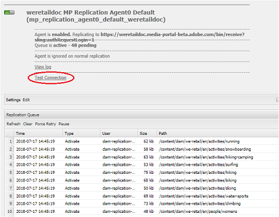

# Troubleshoot issues in parallel publishing to Brand Portal {#troubleshoot-issues-in-parallel-publishing-to-brand-portal}

Brand Portal is configured with Experience Manager Assets to have approved brand assets seamlessly ingested (or published) from Experience Manager Assets author instance. Once [configured](../using/configure-aem-assets-with-brand-portal.md), Experience Manager Author uses a replication agent to replicate one or more selected assets to Brand Portal cloud service for approved usage by Brand Portal users. Multiple replication agents are used Experience Manager 6.2 SP1-CFP5, Experience Manager CFP 6.3.0.2, and onwards to allow high-speed parallel publishing.

>[!NOTE]
>
>To ensure successful configuration of Experience Manager Assets Brand Portal with Experience Manager Assets, Adobe recommends upgrading to Experience Manager 6.4.1.0. A limitation in Experience Manager 6.4 gives an error while configuring Experience Manager Assets with Brand Portal and replication fails.

On configuring a cloud service for Brand Portal under **[!UICONTROL /etc/cloudservice]**, all necessary users and token are auto-generated and saved in the repository. Cloud service configuration is created, service users required for replication and replication agents to replicate content are also created. It creates four replication agents. So when you publish numerous assets from Experience Manager to Brand Portal, the assets are queued and distributed among the replication agents through Round Robin.

However, publishing can fail intermittently due to- large sling jobs, increased Network and **[!UICONTROL Disk I/O]** on Experience Manager Author instance, or slowed performance of Experience Manager Author instance. Adobe recommends testing the connection with one or more replication agents before you begin publishing.

 

## Troubleshoot failures in first-time publishing: validating your publish configuration {#troubleshoot-failures-in-first-time-publishing-validating-your-publish-configuration}

To validate your publish configurations:

1. Check the error logs
1. Check whether the replication agent is created
1. Test connection

**Tail logs while creating Cloud Service**

Check tail logs. Check whether the replication agent is created or not. If the replication agent creation fails, edit the Cloud service by making minor changes in the Cloud service. Validate and check again whether the replication agent is created or not. If not, re-edit the service.

If on repeatedly editing the cloud service it is not configured properly, report a Daycare ticket.

**Test connection with replication agents**

View log, if errors are found in the replication log:

1. Contact Customer Support.

1. Retry [clean-up](../using/troubleshoot-parallel-publishing.md#clean-up-existing-config) and create publish configuration again.

<!--
Comment Type: remark
Last Modified By: Mini Gulati (mgulati)
Last Modified Date: 2018-06-21T22:56:21.256-0400

?? check and compare public key. At times public key is different

?? another thing to check in /useradmin

-->

## Clean-up existing Brand Portal publish configurations {#clean-up-existing-config}

Publishing often fails with a "401 unauthorized" error because the user (for example, `mac-<tenantid>-replication`) lacks the latest private key, and no other error is reported in the replication agent logs. You might want to avoid troubleshooting and create a configuration instead. For the new configuration to work properly, clean up the following from Experience Manager author setup:

1. Go to `localhost:4502/crx/de/` (considering that you are running author instance on `localhost:4502:`)
   i. Delete `/etc/replication/agents.author/mp_replication` 
   ii. Delete `/etc/cloudservices/mediaportal/<config_name>`

1. Go to localhost:4502/useradmin:  
   i. Search for user `mac-<tenantid>replication`
   ii. Delete this user

Now, the system is all cleaned up. Now, you can attempt to create a cloud service config and still use the existing JWT application. There is no need to create an application, rather update the public key from the newly created cloud config.

>[!NOTE]
>
>Do not modify any autogenerated settings.

## Developer connection JWT application tenant visibility issue {#developer-connection-jwt-application-tenant-visibility-issue}

If on `https://legacy-oauth.cloud.adobe.io/`, all the orgs (tenants) for which the current users hold system administrator are listed. If you do not find the org name here or you cannot create an application for a required tenant here, please check if you have sufficient (system administrator) rights.

There is one known issue on this user interface that for any tenant, only the top ten applications are visible. When you create the application, stay on that page and bookmark the URL. Do not go to the listing page of the application and find the application that you created. You can hit this bookmarked URL directly and update or delete the application whenever needed.

The JWT application might not be listed appropriately. It is, therefore, advised that you note or bookmark the URL while creating a JWT application.

## Running Configuration stops working {#running-configuration-stops-working}

<!--
Comment Type: draft

If the running configuration stops working, either of the following two possibilities
<g class="gr_ gr_15 gr-alert gr_gramm gr_inline_cards gr_run_anim Grammar multiReplace" data-gr-id="15" id="15" style="font-size: 12px;">
are
</g> there:

1.
<g class="gr_ gr_14 gr-alert gr_gramm gr_inline_cards gr_run_anim Grammar only-ins doubleReplace replaceWithoutSep" data-gr-id="14" id="14">
Connection
</g> has failed, or

2. Publish has failed with permission to dam-replication-service denied, while connection has passed 

If the connection has failed [1], the
<g class="gr_ gr_10 gr-alert gr_spell gr_inline_cards gr_run_anim ContextualSpelling ins-del multiReplace" data-gr-id="10" id="10">
fail safe
</g> way to fix it is to <a href="../using/troubleshoot-parallel-publishing.md#main-pars-header-1664955658">clean up</a> the existing Brand Portal publish configuration and recreate a publish configuration. 

However, if the
<g class="gr_ gr_18 gr-alert gr_spell gr_inline_cards gr_run_anim ContextualSpelling" data-gr-id="18" id="18">
publish
</g> has failed with
<g class="gr_ gr_16 gr-alert gr_gramm gr_inline_cards gr_run_anim Grammar only-ins doubleReplace replaceWithoutSep" data-gr-id="16" id="16">
permission
</g> denied to dam-replication-service, raise a support ticket.

-->

If a replication agent (which was publishing to Brand Portal just fine) stops processing publish jobs, check replication logs. Experience Manager has auto-retry built-in, so if a particular asset publish fails, it is retried automatically. If there is some intermittent issue like network error, it might succeed during a retry.

If there are continuous publish failures and the queue is blocked, check the **[!UICONTROL test connection]**. Try to solve the errors that are being reported.

Based on the errors, you are advised to log a support ticket, so that the Brand Portal engineering team can help you resolve the issues.

## Brand Portal IMS configuration token expired {#token-expired}

If your Brand Portal environment stops abruptly, there is a possibility that the IMS configurations are not working properly. The system shows an unhealthy IMS configuration and reflects an error message (similar to the following) that your access token is expired. 

`com.adobe.granite.auth.oauth.AccessTokenProvider failed to get access token from authorization server status: 400 response: Unknown macro: {"error"}`

To resolve this issue, Adobe recommends that you manually save and close the IMS configuration and check health status again. If the configurations do not work, delete the existing configurations and create a new one.

## Configure replication agents to avoid connection timeout error {#connection-timeout}

Usually the publishing job fails with a timeout error if there are multiple pending requests in the replication queue. To resolve this issue, ensure that the replication agents are configured to avoid timeout. 

To configure the replication agents:

1. Log in to your AEM Assets author instance.
1. From the **Tools** panel, navigate to **[!UICONTROL Deployment]** > **[!UICONTROL Replication]**.
1. In the Replication page, click **[!UICONTROL `Agents on author`]**. You can see the four replication agents of your Brand Portal tenant. 
1. Click the replication agent URL and click **[!UICONTROL Edit]**.
1. In Agent Settings, click the **[!UICONTROL Extended]** tab. 
1. Select the **[!UICONTROL Close Connection]** check box.
1. Repeat steps 4 through 7 to configure all the four replication agents. 
1. Restart the server.
